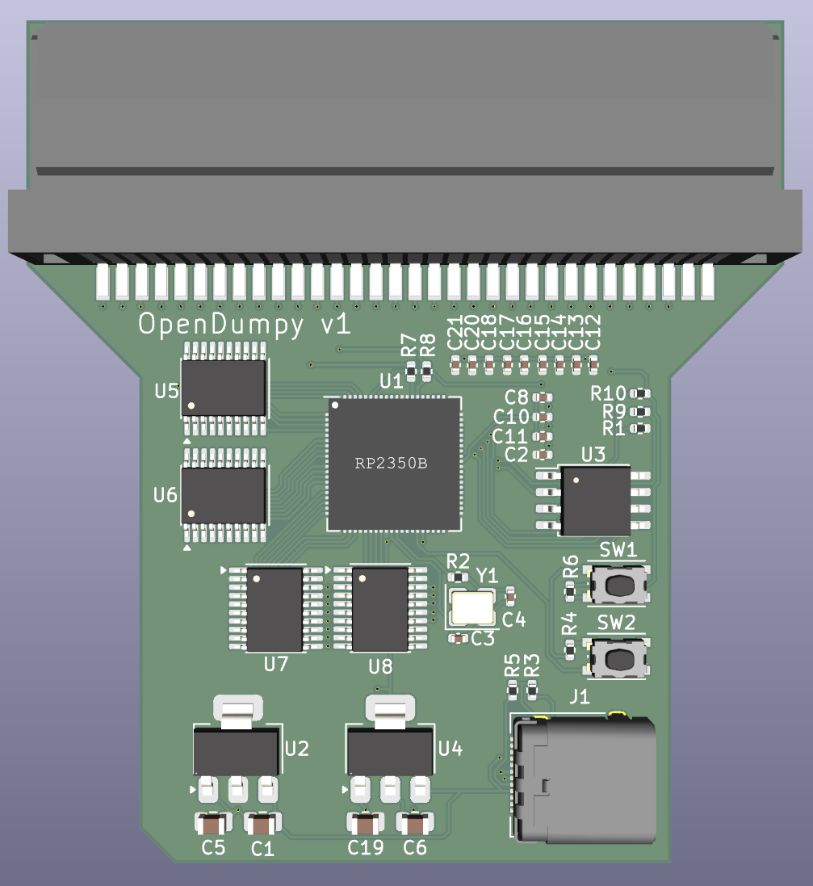
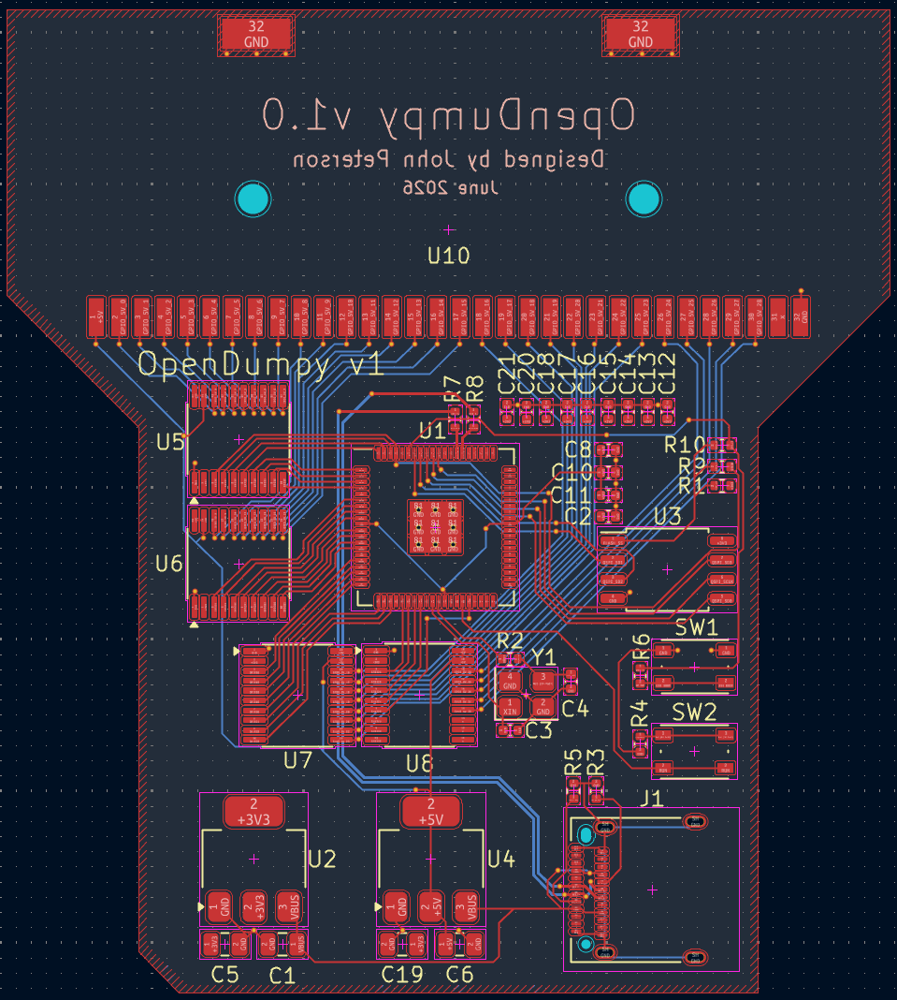
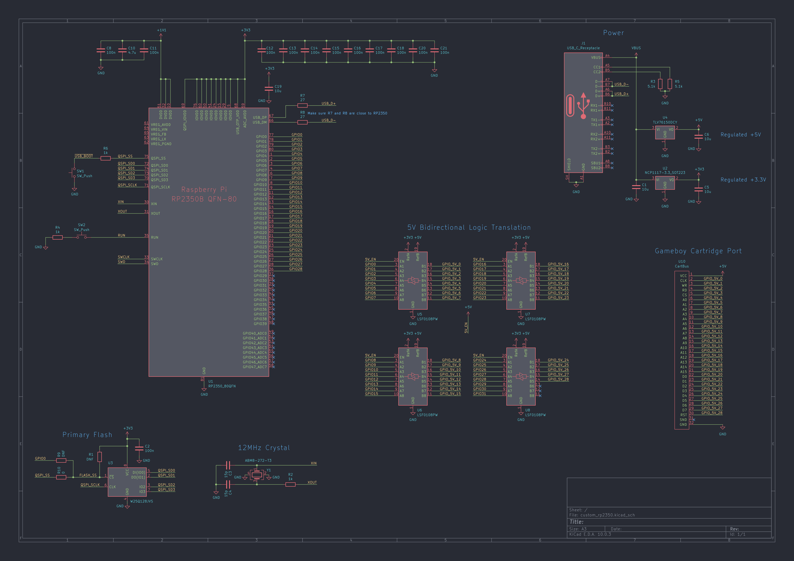

# OpenDumpy: The Open-Source GB/GBC Cartridge Dumper

## What is this?
OpenDumpy is an open-source Gameboy and Gameboy Color cartridge dumper.

Planned Features:
- ROM Dump
- SRAM Dump
- SRAM Uploading from file
- Custom Open-Source USB Communication protocol
  - Will have FOSS software interface included in this repo.
- Lots of docs!

## Current Fabrication Status Status

OpenDumpy v1 boards are on order with PCBWay, expected by the middle of July 2026.

Firmware design is in progress. Actual programming to come soon.

## Setup & Building the UF2

### Install Required Packages

For Arch Linux:
- `cmake`
- `python`
- `base-devel`
- `arm-none-eabi-gcc`
- `arm-none-eabi-newlib`
- `arm-none-eabi-binutils`

For apt-based systems:
- `cmake`
- `python3`
- `build-essential`
- `gcc-arm-none-eabi`
- `libnewlib-arm-none-eabi`
- `libstdc++-arm-none-eabi-newlib`

### Cloning the Repo

When cloning this repo, make sure to _recursively_ initialize all submodules:

```
git clone https://github.com/jpeterson1823/opendumpy.git
cd opendumpy
git submodule update --init --recursive
```

### Compiling the Firmware

Assuming all package dependencies have been installed, building should be completed with CMake and Make.

It is recommended to create a build folder as to not muddy up the file tree:

```
mkdir firmware/build
cd firmware/build
cmake ..
make -j4
```

### Uploading the Firmware

Press the BOOTSEL button on OpenDumpy, then plug into USB port of machine. It will mount as a USB drive. Upload the built `opendumpy.uf2` file to the mounted drive. Voila!

## Images

### OpenDumpy v1



